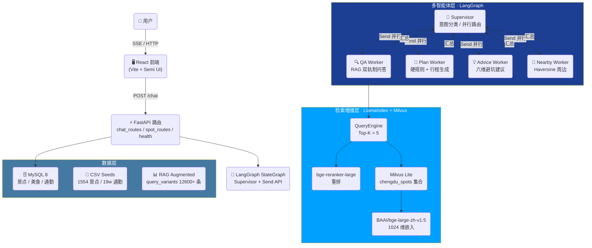
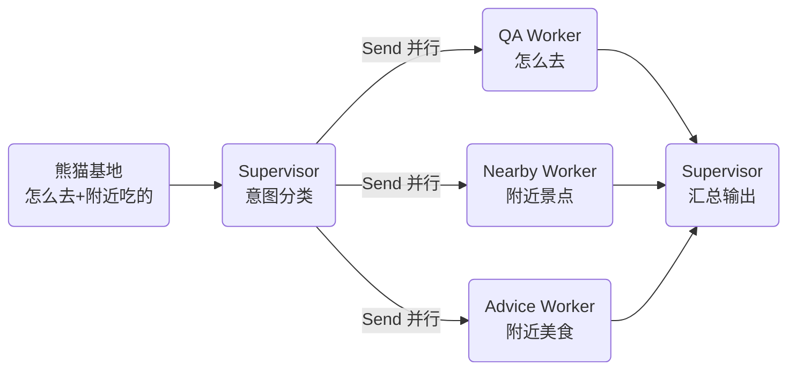

# 🏯 蓉游智体 · Chengdu Travel AI Agent


> 一个基于 **多智能体 + RAG** 的成都旅游问答与行程规划助手，LangGraph 驱动 Supervisor 并行调度 4 个 Worker，LlamaIndex + Milvus 提供双轨制检索增强，53 条硬规则保障行程合理性。

---

## 🧭 项目定位

这是一个**面向真实用户场景**的 AI Agent 实战项目，不是 Demo Toy：

- 🏛️ **覆盖 1554 个成都景点**、80+ 美食、250+ 避坑规则，全量种子数据入库
- 🚇 **19 万条景点间通勤矩阵**（高德地图 API 批量计算），行程规划精确到分钟
- 🛡️ **三层防幻觉**：硬事实强制来自检索内容 + 53 条硬规则 + validate_plan 程序级校验
- 🔄 **多意图并行**：用户问"熊猫基地怎么去 + 附近有什么吃的"，Supervisor 同时派发 QA + Nearby + Advice 三个 Worker
- 💬 **流式 SSE 输出** + 引用标注，前端直接渲染 Markdown

---

## 🏗️ 系统架构



---

## 🧰 技术栈（按层分类）

### ⚡ 后端框架
| 技术 | 版本 | 用途 |
|------|------|------|
|  | 0.115 | ASGI Web 框架，类型安全路由 |
|  | 0.30 | 异步 ASGI 服务器 |
|  | 2.9 | Settings + 数据校验 |
|  | 2.0 | ORM 与 MySQL 连接 |

### 🤖 AI Agent 核心
| 技术 | 版本 | 用途 |
|------|------|------|
|  | 0.2 | StateGraph + Send API 并行调度 |
|  | 0.3 | LLM 抽象 / Runnable / 回调 |
|  | - | 全链路 Trace 可观测性 |
| DeepSeek | V4-Pro / Flash | LLM 推理（多模型切换） |

### 📚 RAG 检索增强
| 技术 | 版本 | 用途 |
|------|------|------|
|  | - | QueryEngine / Retriever |
|  | 3.0 | 本地向量存储（零服务端依赖） |
| BAAI/bge-large-zh | 1.5 | 1024 维中文嵌入模型 |
| bge-reranker-large | - | 重排提升召回精度 |
| BM25 | rank_bm25 | 稀疏检索 + 向量融合 |

### 🖥️ 前端
| 技术 | 版本 | 用途 |
|------|------|------|
|  | 19 | UI 框架 |
|  | 8 | 构建工具 |
|  | 2.103 | 组件库 |
|  | 2.8 | 流式响应 |

### 💾 数据 / 工具
| 技术 | 版本 | 用途 |
|------|------|------|
|  | 8.0 | 景点 / 美食 / 通勤矩阵持久化 |
|  | 5 | 缓存加速层 |
| SqliteSaver | - | LangGraph 跨重启 Checkpointer |
| Loguru | 0.7 | 结构化日志 |

---

## ✨ 核心特性

### 🎯 1. Supervisor 多意图并行路由
用户的模糊查询（如"熊猫基地怎么去 + 附近有什么吃的"）被 Supervisor 分类后，通过 `Send` API **并行派发**到多个 Worker，结果自动汇总：



### 🔍 2. RAG 双轨制 Prompt
- **硬事实轨道**：票价、时间、地址、通勤时间 → **必须来自检索内容**，禁止 LLM 编造
- **软知识轨道**：历史、文化、体验故事 → 分 7 个维度组按需触发，允许 LLM 扩展

### 🛡️ 3. 三层硬规则保障
1. **程序级**：8 条 Python 硬编码规则（如熊猫基地必须 Day1 7:30-12:00）
2. **Prompt 级**：53 条规则注入 System Message
3. **校验级**：`validate_plan()` 程序级校验 + 自动修正

### 🚇 4. 通勤矩阵
- 覆盖 1554 个景点的**双向通勤时间/距离**（19 万行）
- 高德地图 distance 批量 API 计算（100 点/请求）
- 行程规划精确到分钟

### 🧠 5. 长期用户画像记忆（LTM）
- Milvus 向量存储用户偏好（如"喜欢小众景点"）
- 会话间持久化，跨轮次语义去重（阈值 0.92）

---

## 📊 数据规模

| 数据 | 数量 | 说明 |
|------|------|------|
| 景点种子 | **1,554** | 含坐标、等级、开放时间、票价 |
| 美食种子 | **80+** | 含推荐菜品、人均消费 |
| 避坑规则 | **250+** | 景点/交通/通用三类 |
| 硬规则 | **53** | 行程强制约束 |
| 通勤矩阵 | **190,158** | 景点对通勤时间/距离 |
| RAG Query Variants | **12,600+** | 覆盖描述/贴士/文化上下文 |

---

## 📁 项目结构

```
chengdu-travel-agent/
├── backend/
│   ├── app/
│   │   ├── agents/          # 🧠 多智能体
│   │   │   ├── graph.py       # LangGraph StateGraph 构建
│   │   │   ├── nodes.py       # Supervisor + 4 Worker 节点
│   │   │   ├── llm_client.py  # LLM 工厂（多模型切换）
│   │   │   └── utils.py       # validate_plan / haversine / 清洗
│   │   ├── rag/             # 📚 检索增强
│   │   │   ├── embeddings.py    # 嵌入模型 + Reranker
│   │   │   ├── llama_index_engine.py  # QueryEngine 构建
│   │   │   └── prompt_templates.py   # 双轨制 Prompt + 7 维度组
│   │   ├── api/             # ⚡ FastAPI 路由
│   │   │   ├── chat_routes.py    # /api/chat（SSE 流式）
│   │   │   ├── spot_routes.py    # /api/spots
│   │   │   └── health_routes.py  # /api/health
│   │   ├── tools/           # 🔧 外部工具
│   │   │   ├── amap_weather.py   # 高德天气
│   │   │   └── web_search.py     # 联网搜索
│   │   ├── database/        # 💾 数据层
│   │   ├── schemas/         # 📋 Pydantic 模型
│   │   ├── config.py        # ⚙️ Pydantic Settings 单例
│   │   ├── logger.py        # 📝 Loguru 日志
│   │   └── main.py          # 🚀 FastAPI lifespan + 启动
│   ├── scripts/             # 🛠️ 运维脚本
│   │   ├── 01_init_db_create_tables.py   # MySQL 建表
│   │   ├── 02_import_seeds.py            # CSV → MySQL
│   │   └── 03_build_rag_index.py         # Milvus 向量化
│   ├── data/                # 📂 数据（不在 Git 仓库中）
│   │   ├── seeds/             # 原始 CSV 种子
│   │   ├── augmented/         # RAG 增强 CSV
│   │   ├── milvus/            # Milvus Lite 本地 DB
│   │   └── models/            # BGE 模型权重
│   ├── tests/               # 🧪 pytest 测试
│   ├── launch_backend.py    # 🚀 启动入口（dotenv + LangSmith 注入）
│   └── requirements.txt
├── frontend/                # 🖥️ React + Vite
│   └── src/
│       ├── components/        # 8 个 UI 组件
│       │   ├── ChatInput.jsx
│       │   ├── MessageBubble.jsx
│       │   ├── CitationTag.jsx
│       │   ├── PlanCard.jsx
│       │   ├── QACard.jsx
│       │   ├── AdvicePanel.jsx
│       │   ├── NearbyList.jsx
│       │   └── Sidebar.jsx
│       └── api/chatApi.js     # SSE 客户端
└── README.md
```

---

## 🚀 快速启动

### 1. 后端
```bash
cd backend
pip install -r requirements.txt

# 配置环境变量（复制模板）
cp .env.example .env
# 编辑 .env 填入 DeepSeek API Key / MySQL / 高德地图 Key / LangSmith Token

# 初始化数据
python scripts/01_init_db_create_tables.py   # MySQL 建表
python scripts/02_import_seeds.py            # 导入 1554 景点 + 通勤矩阵
python scripts/03_build_rag_index.py         # 向量化 → Milvus Lite

# 启动
python launch_backend.py  # http://localhost:8000
```

### 2. 前端
```bash
cd frontend
npm install
npm run dev  # http://localhost:5173
```

---

## ⚠️ 已知局限 & 后续计划

> 坦诚地说，**这个项目还远不是生产级**。以下是我清楚的短板，也是我接下来想改进的方向。

### 🚧 当前局限

| 维度 | 现状 | 问题 |
|------|------|------|
| **并发** | 单进程 Uvicorn + SqliteSaver | SQLite WAL 在高并发下仍有锁争用，应切 RedisSaver 或 PostgresSaver |
| **鉴权** | JWT 已实现但前端未对接 | `/api/chat` 路由未强制 token，任何人可调用 |
| **数据新鲜度** | 种子 CSV 一次性导入 | 高德数据、票价、开放时间会变，缺少定时增量更新 |
| **前端** | Semi UI + Vite | 组件未抽离 Hook、无状态管理库（Zustand/Redux），对话历史用 localStorage |
| **测试覆盖** | 3 个 pytest 文件 | 只有 Agent / RAG / Worker 基本路径，缺少 API 集成测试 + 前端 E2E |
| **部署** | 本地运行 | 无 Dockerfile、无 CI/CD、无 HTTPS 证书 |
| **LTM** | 已实现向量去重 | 用户画像维度单一，未做多模态偏好（文本+交互行为） |

### 🗺️ 后续计划

- [ ] **鉴权打通**：前端 JWT 登录 + Token 刷新 + 路由守卫
- [ ] **多进程部署**：Gunicorn/Uvicorn Workers + RedisSaver 替换 SqliteSaver
- [ ] **数据管道自动化**：Airflow 或定时脚本，每日拉取高德最新数据 → MySQL → 重建 RAG 索引
- [ ] **前端重构**：Zustand 状态管理 + React 19 Server Components + PWA
- [ ] **可观测性升级**：LangSmith 全链路 + Prometheus/Grafana 指标 + Sentry 错误追踪
- [ ] **Docker + CI/CD**：GitHub Actions → Docker Image → 云服务器
- [ ] **多城市扩展**：从成都 → 西安 / 重庆 / 北京，验证架构可复用性
- [ ] **Eval 体系**：自建问题集 + 自动打分 + RAGAS / TruLens 评估

---

## 📄 License

MIT © FoeikNov
