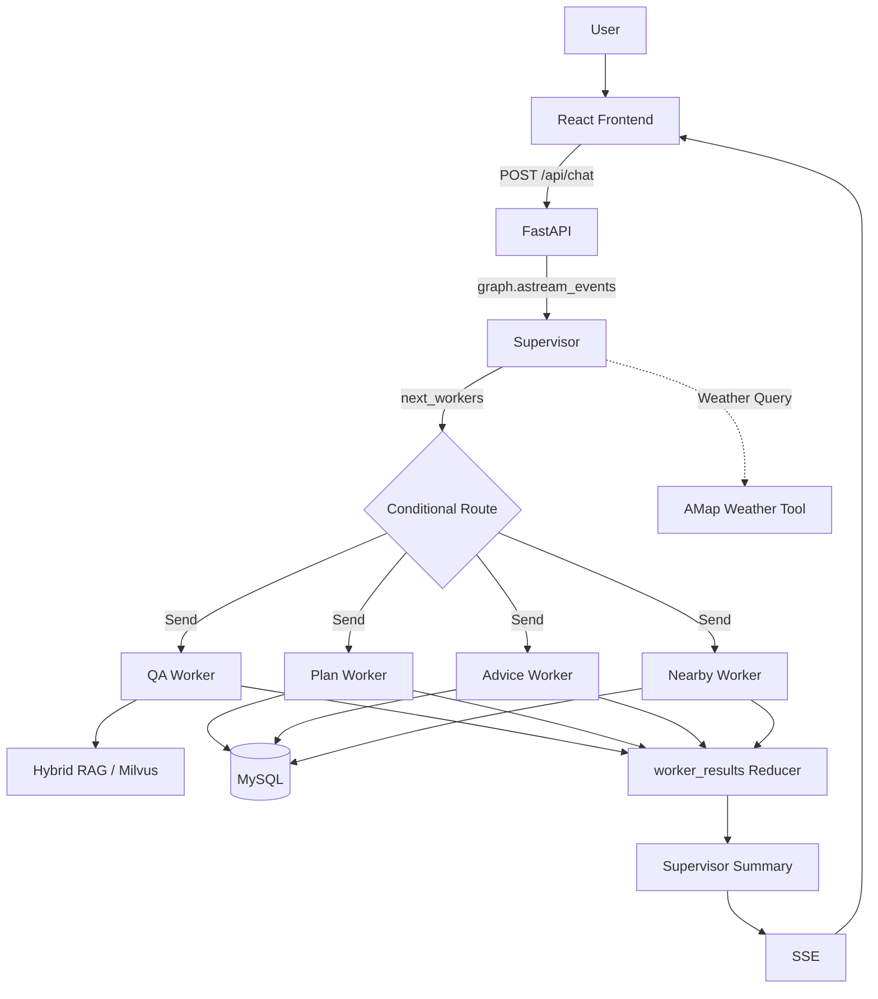
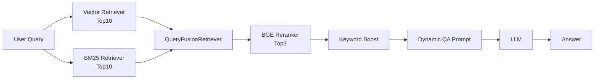
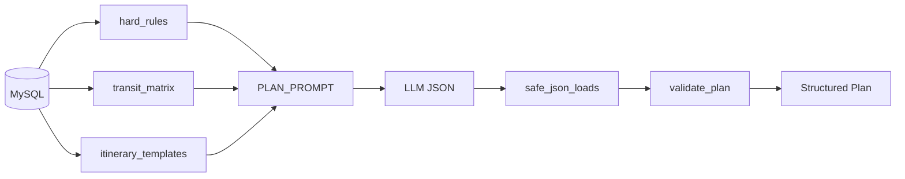

<div align="center">

# 🏯 蓉游智体

### Chengdu Travel AI Agent

**基于 LangGraph Supervisor-Worker 架构的成都旅游多智能体助手**

旅游问答 · 行程规划 · 避坑建议 · 周边检索 · 天气查询 · SSE 流式交互

<p>
  
  
  
  
  
  
</p>

<p>
  <a href="#-项目介绍">项目介绍</a> ·
  <a href="#-系统架构">系统架构</a> ·
  <a href="#-agent-核心机制">Agent 核心</a> ·
  <a href="#-hybrid-rag">Hybrid RAG</a> ·
  <a href="#-快速启动">快速启动</a>
</p>

</div>

---

# ✨ 项目介绍

**蓉游智体（Chengdu Travel AI Agent）** 是一个面向成都旅游场景的 AI Agent 应用。

项目不是单纯的“LLM + Prompt”聊天机器人，而是将 **Agent 编排、RAG 检索、结构化数据库、规则校验、空间计算、外部 API 和流式交互** 组合成一条完整应用链路。

### 🎯 项目希望解决的问题

- 📚 **旅游信息分散**：景点介绍、票价、开放时间、攻略等信息通常需要多平台查询。
- 🗺️ **行程规划复杂**：多日路线还要考虑通勤、闭馆日、景点数量与不同人群需求。
- 📍 **周边关系需要真实计算**：“附近有什么”不应该依赖 LLM 凭记忆猜测。
- 🧩 **用户需求经常是多意图的**：一个问题可能同时包含问答、规划和避坑建议。
- ⚡ **复杂 Agent 链路响应较慢**：需要通过并行执行和 SSE 降低用户等待感。
- 🛡️ **LLM 输出具有不确定性**：关键规则、JSON、距离与数据库结果需要程序兜底。

### 🧠 核心设计思想

- 🤖 **LLM 负责理解与生成**：意图识别、自然语言理解、内容组织。
- ⚙️ **程序负责确定性逻辑**：SQL 查询、Haversine、JSON 解析、规则校验。
- 🔍 **事实优先来自外部数据**：RAG、MySQL、天气 API，而不是模型记忆。
- 🧱 **不同任务拆成不同 Worker**：每个 Worker 使用最适合自己的数据源和算法。
- 🔄 **Agent 通过共享 State 协作**：Worker 不直接互相调用，降低耦合。

### 🌟 核心能力

| 能力 | 处理方式 | 关键实现 |
|---|---|---|
| 📖 **旅游问答** | Hybrid RAG | Milvus + BM25 + BGE Reranker + Dynamic Prompt |
| 🗺️ **行程规划** | 生成 + 校验 | MySQL Rules + LLM JSON + `validate_plan()` |
| 💡 **避坑建议** | 规则增强生成 | `avoid_rules` + Advice Prompt + LLM |
| 📍 **周边景点** | 空间计算 | LLM 参数抽取 + Bounding Box + Haversine |
| 🌤️ **天气查询** | 外部 Tool | 高德天气 API + LLM 整理 |
| ⚡ **多意图并行** | Agent 编排 | Supervisor + `Send` fan-out |
| 🔄 **结果合并** | State Reducer | `worker_results` + `merge_results` |
| 💬 **流式交互** | SSE | `graph.astream_events()` + FastAPI |
| 🧩 **结构化展示** | Worker 结果直出 | PlanCard / AdvicePanel / NearbyList / QACard |
| 🔎 **可观测性** | Trace / Logging | Logging + LangSmith |

### 🧱 项目四个核心组成

<table>
<tr>
<td width="25%" align="center" valign="top">
<b>🤖 Agent</b><br><br>
LangGraph<br>
Supervisor + 4 Worker<br>
Send<br>
Reducer
</td>
<td width="25%" align="center" valign="top">
<b>🔍 Knowledge</b><br><br>
Hybrid RAG<br>
BGE Embedding<br>
BM25<br>
BGE Reranker
</td>
<td width="25%" align="center" valign="top">
<b>🗄️ Data</b><br><br>
MySQL<br>
Milvus<br>
Rules<br>
Spatial Data
</td>
<td width="25%" align="center" valign="top">
<b>⚡ Application</b><br><br>
FastAPI<br>
SSE<br>
React<br>
LangSmith
</td>
</tr>
</table>

---

# 🏗️ 系统架构



### 🧩 分层说明

- 🖥️ **交互层**
  - React 接收用户问题。
  - 消费 SSE 流式文本和结构化卡片数据。

- 🌐 **服务层**
  - FastAPI 提供 `/api/chat`、景点 API、健康检查等接口。
  - 初始化 LangGraph State。
  - 使用 `graph.astream_events()` 获取图执行事件。

- 🤖 **Agent 编排层**
  - Supervisor 进行路由和汇总。
  - `Send` 动态派发一个或多个 Worker。
  - Reducer 合并并行 Worker 输出。

- 🔍 **知识 / 数据层**
  - Milvus：向量与知识节点。
  - MySQL：景点、规则、通勤和行程模板。

- 🛠️ **外部能力层**
  - DeepSeek Chat API。
  - 高德天气 API。
  - LangSmith Trace。

---

# 🔄 一次请求如何执行

```text
User
  ↓
React
  ↓ POST /api/chat
FastAPI
  ↓
initial_state
  ↓
graph.astream_events()
  ↓
Supervisor / routing
  ↓
next_workers
  ↓
Send
  ↓
一个或多个 Worker 并行执行
  ↓
worker_results
  ↓
Reducer
  ↓
Supervisor / summary
  ↓
final_answer
  ↓
SSE
  ↓
React
```

### ① 📥 请求进入 FastAPI

- 接收用户 `message` 和 `session_id`。
- 构造 `MultiAgentState` 初始状态。
- 创建本次执行对应的 `thread_id`。
- 启动 LangGraph。

### ② 🧭 Supervisor 做 Routing

- 获取最近一条 HumanMessage。
- 对普通问题做结构化意图分类。
- 生成 `next_workers`。
- 对 Worker 名称进行去重与白名单过滤。
- 分类失败时回退到 `qa_worker`。

### ③ ⚡ Send 并行派发 Worker

例如：

```text
用户：帮我规划成都三日游，并给一些避坑建议

Supervisor
    ↓
next_workers = [plan_worker, advice_worker]
    ↓
Send
   ↙  ↘
Plan  Advice
```

### ④ 🔄 Reducer 合并结果

多个 Worker 同时写入：

```text
worker_results
```

由自定义 `merge_results` Reducer 合并，避免结果互相覆盖。

### ⑤ 🧠 Supervisor 做 Summary

- 读取全部 `worker_results`。
- 组织 Worker 上下文。
- 调用默认 LLM 生成统一回答。
- 写入 `final_answer`。

### ⑥ 📡 SSE 返回前端

- `token`：最终回答的增量文本。
- `structure_ready`：已经完成的结构化 Worker 结果。
- `end`：整个 Agent 请求完成。

---

# 🤖 Agent 核心机制

## 🧭 Supervisor

Supervisor 是整个图的 orchestration 中心。

### Routing 阶段

- 🎯 判断用户问题需要哪些能力。
- 📤 输出 `next_workers`。
- ✅ 对结果做白名单校验。
- 🛟 路由失败时默认使用 QA Worker。
- ⚡ 问候与天气走快捷路径。

### Summary 阶段

- 📥 读取合并后的 `worker_results`。
- 🧩 组织 QA / Plan / Advice / Nearby 专项结果。
- ✍️ 生成最终自然语言回答。
- 🛟 汇总模型失败时直接降级使用已有 Worker 结果。

---

## 🧠 MultiAgentState

核心 State 字段：

| 字段 | 作用 |
|---|---|
| `messages` | 用户 / AI 消息，使用 `add_messages` Reducer |
| `next_workers` | Supervisor 路由结果 |
| `worker_results` | 各 Worker 专项结果 |
| `phase` | `routing` / `summary` |
| `final_answer` | 最终面向用户的回答 |
| `debug_info` | 节点调试信息 |

### 🔑 State 设计要点

- `messages` 使用 `add_messages` 追加消息。
- `worker_results` 使用 `merge_results` 合并并行结果。
- `phase` 明确区分 Supervisor 的两个阶段。
- Worker 只返回自己负责的数据，不直接操作其他 Worker。

---

## 📤 Send 与 Reducer

```text
Send    = fan-out
Reducer = merge
```

### Send 解决什么？

- 一个请求可以同时触发多个 Worker。
- 不需要把所有 Worker 写成固定串行 Edge。
- Supervisor 只做决策，Graph 负责真正调度。

### Reducer 解决什么？

假设三个 Worker 分别返回：

```text
QA Result
Plan Result
Advice Result
```

Reducer 最终合并成：

```text
worker_results = {
  qa_worker: ...,
  plan_worker: ...,
  advice_worker: ...
}
```

避免普通 State 覆盖导致并行结果丢失。

---

# 👷 四个 Worker

## 📖 1. QA Worker — 旅游知识问答

### 🎯 负责

- 景点介绍。
- 票价 / 开放信息。
- 历史文化。
- 游览攻略。
- 旅行相关知识问答。

### 🔍 执行链

```text
Query
  ↓
build_query_engine()
  ↓
Vector Retriever + BM25
  ↓
Query Fusion
  ↓
BGE Reranker
  ↓
Keyword Boost
  ↓
Dynamic QA Prompt
  ↓
LLM
```

### 🛟 Fallback

- RAG 有有效结果：优先使用知识库上下文。
- RAG 无有效结果：软知识允许 LLM 补充。
- 票价、开放时间等硬事实：提示以官方信息为准，避免模型编造。

---

## 🗺️ 2. Plan Worker — 多日行程规划

### 🎯 负责

- 多日旅游路线。
- 景点组合。
- 行程时间安排。
- 通勤与规则约束。

### 🗄️ 数据来源

- `hard_rules`：旅游业务硬规则。
- `transit_matrix`：景点之间通勤信息。
- `itinerary_templates`：行程参考模板。

### 🔄 执行链

```text
MySQL Rules / Transit / Templates
        ↓
PLAN_PROMPT
        ↓
LLM JSON
        ↓
safe_json_loads()
        ↓
validate_plan()
        ↓
Structured Plan
```

### 🛡️ 设计重点

- Prompt 负责生成约束。
- JSON Mode 负责结构化输出。
- `safe_json_loads()` 处理异常 JSON。
- `validate_plan()` 对关键规则再次程序校验。

---

## 💡 3. Advice Worker — 避坑与旅行建议

### 🎯 负责

- 交通建议。
- 预算建议。
- 避坑信息。
- 拍照 / 美食 / 出行提醒。

### 🔄 执行链

```text
用户问题
   ↓
MySQL avoid_rules
   ↓
high severity rules
   ↓
ADVICE_PROMPT
   ↓
LLM
```

### 🛟 Fallback

- 数据库规则加载失败时，退化到普通 LLM 建议模式。
- Worker 异常时返回错误结果，不主动破坏其他 Worker。

---

## 📍 4. Nearby Worker — 周边景点

### 🎯 负责

回答：

```text
“宽窄巷子附近 3 公里有什么景点？”
```

### 🔄 执行链

```text
自然语言问题
  ↓
LLM JSON
提取 spot_name / radius_km
  ↓
MySQL 查询目标坐标
  ↓
Bounding Box 粗筛
  ↓
Haversine 精确计算
  ↓
过滤半径
  ↓
按距离排序
  ↓
Top10
```

### ⚙️ 为什么这样设计？

- LLM 负责理解自然语言。
- SQL 负责快速过滤数据库记录。
- Haversine 负责真实球面距离。
- 不依赖 LLM 记忆判断“附近”。

---

# 🔍 Hybrid RAG

QA Worker 使用 LlamaIndex 组织一套双路召回 + 二阶段精排的 Hybrid RAG Pipeline。



## ① 🧠 BGE Embedding + Milvus

- 模型：`BAAI/bge-large-zh-v1.5`。
- Query 使用 BGE instruction 前缀。
- Query / Document 向量做 L2 normalize。
- Milvus 保存向量与 TextNode。
- Vector Retriever 召回 Top10。

**主要作用：**解决字面不同但语义接近的问题。

---

## ② 🔤 BM25 关键词召回

- 从 Milvus 加载原始 TextNode。
- 构建 BM25 Retriever。
- 同样召回 Top10。
- 中文采用字符级 token pattern：

```text
[\u4e00-\u9fa5]|[a-zA-Z0-9]+
```

**主要作用：**补强景点专名、票价、开放时间等关键词明确的问题。

---

## ③ 🔀 Query Fusion

- Vector Retriever 和 BM25 Retriever 同时召回。
- `QueryFusionRetriever` 合并候选结果。
- 提高整体 Recall。

---

## ④ 🎯 BGE Reranker

- 模型：`BAAI/bge-reranker-large`。
- 对候选文档执行二阶段精排。
- 最终保留 Top3 作为 LLM 主要上下文。

```text
Retriever = 大范围召回
Reranker  = 小范围精排
```

---

## ⑤ 📈 Keyword Boost

Reranker 后再增加业务排序规则：

- `source_name` 与 Query 中景点名字符重叠时提高 score。
- `chunk_type=travel_tips` 时额外加权。

这一层不是新的检索算法，而是面向旅游业务的后处理。

---

## ⑥ 📝 Dynamic QA Prompt

项目将知识分成：

### 🔒 硬事实

- 票价。
- 开放时间。
- 地址。
- 经纬度。
- 评分。
- 通勤时间。

**策略：**优先使用检索上下文，缺失时避免自行编造。

### 💬 软知识

- 历史文化。
- 游览攻略。
- 季节建议。
- 特殊人群建议。
- 装备准备。

**策略：**以检索内容为基础，可做有限合理扩展。

`build_qa_prompt()` 会根据 Query 关键词动态选择对应知识维度，而不是每次都把所有 Prompt 塞进去。

---

# 🗺️ 行程规划与规则校验



### 📚 规则数据

- 📌 `hard_rules`：业务规则。
- 🚇 `transit_matrix`：景点间通勤。
- 🧾 `itinerary_templates`：已有路线模板。

这些数据运行时从 MySQL 读取，而不是全部写死在 Prompt 中。

### ✅ 当前校验规则

| Rule | 规则 | 当前处理 |
|---|---|---|
| R-001 | 熊猫基地安排在 Day1 上午 | ✅ 强制修正 |
| R-002 | 都江堰 / 青城山避免与市区景点混排 | ⚠️ violation 检测 |
| R-003 | 武侯祠 / 锦里组合关系 | ⚠️ violation 检测 |
| R-004 | 杜甫草堂 / 金沙遗址组合关系 | ⚠️ violation 检测 |
| R-005 | 周一闭馆规则 | ⚠️ violation 检测 |
| R-006 | 每日景点数量 | ⚠️ violation 检测 |
| R-007 | 每日总通勤时间 | ⚠️ violation 检测 |
| R-008 | 亲子 / 老人高海拔路线 | ⚠️ violation 检测 |

### 💡 核心原则

```text
LLM 负责生成
程序负责校验
```

Prompt 是概率约束；闭馆日、数量、通勤等确定性规则继续使用 Python 检查。

---

# 📍 周边检索与天气

## 📌 Nearby：Bounding Box + Haversine

### 执行步骤

- ① 🧠 LLM 抽取 `spot_name` 和 `radius_km`。
- ② 🗄️ MySQL 查询目标景点坐标。
- ③ 📦 Bounding Box 在 SQL 层粗过滤候选点。
- ④ 📐 Haversine 计算真实球面距离。
- ⑤ 🚫 排除目标景点自身。
- ⑥ 📏 过滤超过 radius 的地点。
- ⑦ 🔢 按距离升序返回 Top10。

```text
Bounding Box = 低成本粗筛
Haversine    = 精确二次计算
```

---

## 🌤️ Weather Tool

天气不是独立 Worker，而是 Supervisor 的快捷路径。

```text
Supervisor
  ↓
is_weather_query()
  ↓
高德 Weather API
  ↓
实时 / 未来天气
  ↓
LLM
  ↓
出行建议
```

### 当前用途

- ☀️ 天气状态。
- 🌡️ 温度信息。
- ☔ 是否需要带伞。
- 👕 穿衣建议。
- 🚶 出行建议。

---

# 🗄️ 数据与存储

## 🐬 MySQL

Agent 主链主要使用：

- 📍 `spots`：景点、描述、经纬度等结构化数据。
- 📌 `hard_rules`：行程规划硬规则。
- 🚇 `transit_matrix`：景点之间通勤数据。
- 🧾 `itinerary_templates`：路线模板。
- ⚠️ `avoid_rules`：避坑规则。

其他 Seed 数据：

- 🍜 `foods`。
- 🏪 `food_shops`。

当前 Nearby 主链仍只查询 `spots`，食品相关数据主要为后续能力扩展保留。

景点 API 面向约 **1,554 条成都景点数据**，支持关键词、等级、区域和分页筛选。

---

## 🧬 Milvus

主要负责：

- 🔢 存储 BGE Embedding。
- 📄 保存知识 TextNode。
- 🔍 向量相似度召回。
- 🔤 为 BM25 构建过程提供原始文本节点。

配置兼容：

- Milvus Lite 本地文件模式。
- Milvus Standalone URI。

---

## 💾 Checkpointer

Graph 编译时可以注入 Checkpointer。

支持：

- 🗃️ SQLite（默认）。
- 🐘 PostgreSQL。
- 🔴 Redis。
- 🧪 MemorySaver。

### 当前实现边界

当前 `/api/chat` 每次请求会根据：

```text
session_id + timestamp + uuid
```

生成唯一 `thread_id`。

因此当前 Checkpointer 主要用于：

- 单次 Graph 执行状态隔离。
- 执行过程持久化。

当前并没有直接把同一个浏览器 `session_id` 复用成 LangGraph 的多轮长期会话 State。

---

# 🧩 LLM 调用策略

项目对用户只保留 **一个默认模型**，不提供多模型模式选择。

内部根据任务性质使用三种配置：

| 实例 | 用途 | Streaming |
|---|---|---|
| `llm` | Supervisor 最终回答、天气结果整理 | ✅ Yes |
| `llm_json` | Supervisor 分类、Plan JSON、Nearby 参数抽取 | ❌ No |
| `llm_worker` | Advice、QA fallback 等内部完整文本生成 | ❌ No |

### 为什么内部任务关闭 Streaming？

避免内部控制信息，例如：

```json
{"next_workers": ["qa_worker"]}
```

被 `graph.astream_events()` 捕获并误推送给前端用户。

---

# 📡 SSE 流式响应

聊天接口：

```text
POST /api/chat
```

后端执行链：

```text
ChatRequest
  ↓
initial_state
  ↓
build_graph(checkpointer)
  ↓
graph.astream_events()
  ↓
SSE Event Generator
```

### 📬 当前事件类型

- 💬 **`token`**
  - 最终回答的增量文本。

- 🧩 **`structure_ready`**
  - Worker 完成后立即推送结构化结果。

- ✅ **`end`**
  - 整个 Agent 请求完成。

### 🧱 Worker 与前端卡片

```text
plan_worker   → plan_card
advice_worker → advice_panel
nearby_worker → nearby_list
qa_worker     → qa_card
```

前端使用 `sse.js` 消费 POST + SSE。

---

# 🛡️ 容错与降级

项目尽量避免“一处失败导致整个 Agent 请求失败”。

- 🧭 **Supervisor 分类失败**
  - 默认回退 `qa_worker`。

- 📦 **LLM 输出非法 JSON**
  - 使用 `safe_json_loads()` 容错。
  - Worker 列表无合法节点时回退 QA。

- 🗺️ **Plan 数据库查询失败**
  - 使用无规则上下文继续生成。

- 💡 **Advice 规则查询失败**
  - 退化成普通 LLM 建议模式。

- 🔍 **RAG 无有效答案**
  - 对软知识使用 LLM fallback。

- 👷 **单 Worker 异常**
  - 将错误结果写入 `worker_results`。
  - 尽量不影响其他 Worker。

- 🧠 **Supervisor 汇总失败**
  - 直接使用已有 Worker 结果降级返回。

- 🌤️ **天气 LLM 整理失败**
  - 直接返回高德天气结构化数据。

- ✅ **非法 Worker 名称**
  - 通过 `VALID_WORKERS` 白名单过滤。

---

# 🔎 可观测性与测试

## 📜 Logging

用于记录：

- Agent 执行阶段。
- Worker 调用。
- RAG 检索。
- 数据库异常。
- LLM / Tool 错误。

## 🧭 LangSmith

项目配置支持 LangSmith Trace，用于观察：

- Graph 节点执行路径。
- LLM 调用。
- Agent 延迟。
- Prompt / Response。

## 🧪 Pytest

```bash
cd backend
pytest tests
```

当前测试：

- 🤖 **`test_agent.py`**
  - Graph 构建。
  - Supervisor 路由。
  - 多意图路由。
  - 非法 Worker 过滤。
  - Supervisor Summary。
  - Reducer。

- ⚙️ **`test_workers.py`**
  - Haversine。
  - `safe_json_loads()`。
  - `merge_results()`。
  - `validate_plan()` R-001 ~ R-008。

- 🔍 **`test_rag.py`**
  - 真实检索链 Top1 命中验证。
  - 熊猫基地开放信息。
  - 杜甫草堂门票等典型 Query。

---

# 🧰 技术栈

| 层级 | 技术 |
|---|---|
| 🖥️ Frontend | React / Vite / Semi UI / sse.js |
| 🌐 Backend | Python / FastAPI / Uvicorn / Pydantic |
| 🤖 Agent | LangGraph / LangChain |
| 🧠 LLM | DeepSeek OpenAI-compatible Chat API |
| 🔍 RAG | LlamaIndex / Milvus / BM25 |
| 🧬 Embedding | BAAI/bge-large-zh-v1.5 |
| 🎯 Reranker | BAAI/bge-reranker-large |
| 🗄️ Database | MySQL / SQLAlchemy / PyMySQL |
| 💾 Checkpoint | SQLite / PostgreSQL / Redis / MemorySaver |
| 🌤️ Tool | 高德天气 API |
| 📡 Streaming | SSE / `graph.astream_events()` |
| 🔎 Observability | Logging / LangSmith |
| 🧪 Testing | Pytest / pytest-asyncio |

---

# 📁 项目结构

```text
Foeiknov-code/
├── backend/
│   ├── app/
│   │   ├── agents/
│   │   │   ├── graph.py              # StateGraph / Send / Worker 路由
│   │   │   ├── nodes.py              # Supervisor + 4 Worker
│   │   │   ├── llm_client.py         # LLM / JSON / Worker 调用配置
│   │   │   └── utils.py              # Haversine / JSON / validate_plan
│   │   │
│   │   ├── api/
│   │   │   ├── chat_routes.py        # POST /api/chat + SSE
│   │   │   ├── spot_routes.py        # 景点查询 API
│   │   │   └── health_routes.py      # 全链路健康检查
│   │   │
│   │   ├── database/
│   │   │   ├── mysql_client.py       # SQLAlchemy Engine
│   │   │   └── checkpoint_factory.py # Checkpointer Factory
│   │   │
│   │   ├── rag/
│   │   │   ├── llama_index_engine.py # Hybrid Retriever / Reranker
│   │   │   ├── embeddings.py         # BGE Embedding
│   │   │   └── prompt_templates.py   # Dynamic QA / Agent Prompts
│   │   │
│   │   ├── schemas/
│   │   │   ├── agent_models.py       # MultiAgentState / Reducer
│   │   │   └── api_models.py         # Pydantic API Schema
│   │   │
│   │   ├── tools/
│   │   │   └── amap_weather.py       # 高德天气工具
│   │   │
│   │   ├── config.py
│   │   ├── logger.py
│   │   └── main.py
│   │
│   ├── data/
│   │   ├── seeds/                    # spots / foods / rules / transit 数据
│   │   └── augmented/                # RAG 增强数据
│   ├── scripts/                      # 数据处理 / 初始化脚本
│   ├── tests/
│   │   ├── test_agent.py
│   │   ├── test_rag.py
│   │   └── test_workers.py
│   ├── requirements.txt
│   └── .env.example
│
├── frontend/
│   ├── src/
│   │   ├── api/chatApi.js            # SSE Client
│   │   ├── components/               # Plan / Advice / Nearby / QA Cards
│   │   └── App.jsx
│   └── package.json
│
├── README.md
└── LICENSE
```

---

# 🚀 快速启动

## ① 📥 克隆项目

```bash
git clone https://github.com/Cetatp/Foeiknov-code.git
cd Foeiknov-code
```

## ② 🐍 启动后端

```bash
cd backend
python -m venv .venv
```

激活虚拟环境后：

```bash
pip install -r requirements.txt
cp .env.example .env
python launch_backend.py
```

也可以：

```bash
uvicorn app.main:app --host 0.0.0.0 --port 8000 --reload
```

默认：

```text
Backend: http://localhost:8000
Docs:    http://localhost:8000/docs
```

## ③ ⚛️ 启动前端

```bash
cd frontend
npm install
npm run dev
```

默认：

```text
http://localhost:5173
```

---

# 🔐 环境变量

完整配置参考：

```text
backend/.env.example
```

核心变量：

| 变量 | 用途 |
|---|---|
| `DEEPSEEK_API_KEY` | DeepSeek API Key |
| `DEEPSEEK_BASE_URL` | OpenAI-compatible Base URL |
| `DEEPSEEK_MODEL` | 默认 LLM |
| `AMAP_API_KEY` | 高德天气 API |
| `MYSQL_HOST` / `MYSQL_PORT` | MySQL 地址 |
| `MYSQL_USER` / `MYSQL_PASSWORD` | MySQL 认证 |
| `MYSQL_DB` | 业务数据库 |
| `MILVUS_DB_PATH` | Milvus Lite 文件或 Standalone 地址 |
| `MILVUS_COLLECTION_SPOTS` | RAG Collection |
| `EMBED_MODEL_NAME` | BGE Embedding 模型 |
| `RERANKER_MODEL_NAME` | BGE Reranker 模型 |
| `CHECKPOINT_BACKEND` | sqlite / postgres / redis / memory |
| `LANGCHAIN_TRACING_V2` | LangSmith 开关 |

---

# 🔌 API

## 💬 `POST /api/chat`

Agent 对话入口，返回：

```text
Content-Type: text/event-stream
```

Request：

```json
{
  "message": "帮我规划成都三日游，再给我一些避坑建议",
  "session_id": "demo-session",
  "stream": true
}
```

SSE Events：

```text
token
structure_ready
end
```

---

## 📍 `GET /api/spots`

支持：

- `keyword`
- `spot_level`
- `area_tag`
- `limit`
- `offset`

示例：

```text
GET /api/spots?keyword=熊猫&limit=10
```

---

## 📄 `GET /api/spots/{spot_id}`

返回景点详情，包括：

- description
- travel_tips
- cultural_context
- 其他景点结构化信息

---

## ❤️ `GET /health`

检查关键组件：

- MySQL
- Milvus
- LLM
- Checkpointer

---

# 💡 关键设计取舍

### 🤖 为什么使用 Supervisor-Worker？

- QA、Plan、Advice、Nearby 使用完全不同的数据源与算法。
- 避免一个巨大 Prompt 同时承担检索、规划、空间计算和规则判断。
- Worker 可以独立维护和扩展。

### 🔄 为什么 Worker 不互相直接调用？

- 保持 Worker 低耦合。
- 统一通过 State 和 LangGraph 协调。
- 调度逻辑集中在 Supervisor / Graph。

### 🔍 为什么 Hybrid Retrieval？

- Vector：擅长语义相似。
- BM25：擅长关键词和专有名词。
- 两路结合提高 Recall。

### 🎯 为什么需要 Reranker？

- Retriever 适合快速召回。
- Reranker 更精确但成本更高。
- 因此采用“先召回，再精排”。

### 🗺️ 为什么 Plan 还要 Python 校验？

- Prompt 属于概率约束。
- 闭馆日、数量、通勤等规则可以确定性检查。
- 关键业务规则不完全依赖模型自觉遵守。

### 📍 为什么 Nearby 不直接让 LLM 推荐？

- “附近”是可计算的空间关系。
- 数据库坐标 + Haversine 更准确。
- 避免模型产生不存在或距离错误的地点。

### 📡 为什么使用 SSE？

- Agent 链路包含路由、Worker、RAG 和 LLM。
- 完整执行耗时可能较长。
- SSE 可以提前展示 Token 和结构化卡片，降低等待感。

---

# 📌 当前边界与 Roadmap

## 🚀 1. RAG 初始化性能

当前：

- QA 请求动态构造 QueryEngine。
- 从 Milvus 重新加载节点构建 BM25。

后续：

- ✅ 启动时预构建 Retriever / Reranker / QueryEngine。
- ✅ 使用单例缓存。
- ✅ 知识库变化时增量刷新 BM25。

---

## 🔧 2. Plan Repair Loop

当前：

- R-001 已直接修正。
- R-002 ~ R-008 主要记录 violation。

后续可扩展：

```text
Generate
  ↓
Validate
  ↓
Violation?
  ↓ Yes
Repair
  ↓
Validate Again
```

并设置最大 Repair 次数避免无限循环。

---

## 🍜 3. Nearby 扩展为 POI 推荐

当前：

- Nearby 只查询 `spots`。

后续：

- 接入 `foods`。
- 接入 `food_shops`。
- 统一景点 / 美食 / 商圈 POI 推荐。

---

## 💬 4. 多轮状态

当前：

- 每个请求使用独立 `thread_id`。

后续可以将：

```text
稳定 session / thread id
+
请求级 execution id
```

分开设计，并明确哪些 State 允许跨轮持久化。

---

## 📊 5. RAG Evaluation

后续计划增加：

- Recall@K。
- MRR / NDCG。
- Reranker 前后对比。
- Answer Faithfulness。
- 自动化 Query Set 回归。

---

<div align="center">

### 🐼 蓉游智体 · Chengdu Travel AI Agent

Built with **LangGraph · FastAPI · LlamaIndex · Milvus · MySQL · React**

</div>

# 📄 License

MIT License
