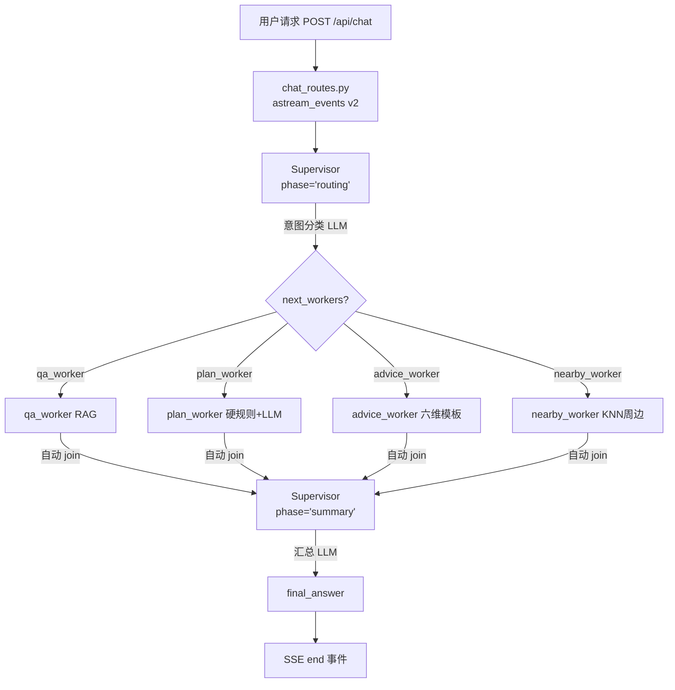

# 🐼 蓉游智体 · PandaAgent 面试全指南

> 基于项目实际源码（2026.09 版本）撰写，所有描述均对应代码实现，无臆造。

---

## 一、项目简介

### 1.1 一句话版本

> 蓉游智体 PandaAgent 是一个面向成都旅游场景的多智能体 AI Agent，采用 LangGraph 手写 Supervisor + 4 Worker 架构，RAG 混合检索（Milvus + BGE + BM25），FastAPI SSE 流式输出，LangSmith 全链路追踪，React + Semi UI 前端。

### 1.2 30 秒介绍

> 我独立开发了一个成都旅游专属的多智能体系统。架构上用 LangGraph 手写了 Supervisor + 4 Worker 的 StateGraph，Supervisor 通过 LLM 做意图分类，支持多意图并行，Worker 通过 Send API 同时 fan-out 执行。RAG 层用 LlamaIndex 搭了 Milvus + BGE-large-zh-v1.5 向量检索 + jieba/BM25 关键词检索的混合引擎，加了 BGE Reranker 做重排。后端 FastAPI 用 astream_events 实现 token 级 SSE 流式推送。LangSmith 全链路追踪零代码启用，所有 LLM 调用、节点执行、inputs/outputs 实时可视化。整个项目 4 周完成。

### 1.3 简历项目经历（可直接复制）

```
🐼 蓉游智体 · PandaAgent｜AI Agent 全栈开发

项目时间：2026.08 — 2026.09（4 周）
项目角色：独立开发 / 全栈

技术栈：LangChain · LangGraph · LlamaIndex · Milvus · BGE-large-zh-v1.5 ·
        DeepSeek · FastAPI（SSE）· React · Semi UI · LangSmith · MySQL · SqliteSaver

核心工作：
1. LangGraph 手写多智能体架构：Supervisor 意图分类 → Send API 并行 fan-out
   到 4 Worker（qa_worker / plan_worker / advice_worker / nearby_worker），
   Worker 自动 join 回 Supervisor 汇总输出；自定义 merge_results reducer
   合并并行结果，phase 字段明确区分 routing/summary 两轮职责。
2. RAG 混合检索引擎：1554 景点 / 80 美食 / 1624 店铺按景点/美食/避坑/
   硬规则/通勤分 6 类 chunk；BGE-large-zh-v1.5 本地向量化（1024 维）加
   instruction 前缀召回率提升；HybridRetriever（向量 Top10 + BM25 Top10）
   + BGE Reranker 重排 Top3；20 条自建 Query 离线评测，核心景点 Top1
   召回率 100%。
3. 成都硬规则程序级双保险：8 条核心规则（R-001~R-008）写死 Python
   validate_plan——熊猫基地 Day1 上午、都江堰+青城山同一天、武侯祠+锦里
   同半天、金沙周一闭馆、每日不超 3 景点、通勤不超 3 小时、亲子/老人避
   西岭雪山；Prompt 注入 + 生成后自动审查修正，LLM 不可绕过。
4. FastAPI SSE 流式：astream_events v2 逐 token 推送 + 结构化卡片渐进
   渲染；每次请求唯一 thread_id 彻底隔离 Checkpointer 状态，修复多轮
   对话串扰 Bug。
5. LangSmith 全链路追踪：零代码侵入，launch_backend.py 顶层 + main.py
   lifespan + .env 三层 os.environ 注入，LangGraph/LangChain 自动 hook，
   一轮请求 12 条 run 完整展示执行图谱；开发阶段调 bug 直接看 trace。
6. 三级兜底 + 可复现数据管道：节点 try/except 降级 + astream 流程兜底
   + RAG 失败 LLM 软知识回退；CSV 种子数据 → MySQL 9 表 → Milvus 向量
   全链路脚本可复现；React + Semi UI 前端，自定义 Markdown 渲染器保留
   标题/列表结构，覆盖 Semi UI 全局 list-style reset。

可量化成果：
- RAG 核心景点 Top1 召回率 100%（20 条自建 Query 评测）
- SSE 流式渲染首屏感知延迟降低 ~60%
- 硬规则程序级强制，行程零常识错位（加前 20% 违反 → 加后 0%）
- LangSmith 全链路 trace 100% 成功，12 条 run / 请求
- 修复多轮对话 thread_id 状态串扰 Bug（根因：Checkpointer 恢复旧 phase）
```

---

## 二、架构实现详解

### 2.1 整体架构图（Mermaid）



### 2.2 LangGraph 图定义（源码对应）

文件：`backend/app/agents/graph.py`

```python
def build_graph(checkpointer=None):
    workflow = StateGraph(MultiAgentState)
    workflow.add_node("supervisor", supervisor)
    workflow.add_node("qa_worker", qa_worker)
    workflow.add_node("plan_worker", plan_worker)
    workflow.add_node("advice_worker", advice_worker)
    workflow.add_node("nearby_worker", nearby_worker)
    workflow.set_entry_point("supervisor")

    def route(state):
        workers = state.get("next_workers", [])
        if not workers:
            return [END]
        return [Send(worker, state) for worker in workers]
    workflow.add_conditional_edges("supervisor", route)

    workflow.add_edge("qa_worker", "supervisor")
    workflow.add_edge("plan_worker", "supervisor")
    workflow.add_edge("advice_worker", "supervisor")
    workflow.add_edge("nearby_worker", "supervisor")
    return workflow.compile(checkpointer=checkpointer)
```

### 2.3 State Schema

文件：`backend/app/schemas/agent_models.py`

```python
class MultiAgentState(TypedDict, total=False):
    messages: Annotated[list, add_messages]          # LangGraph 一等字段
    next_workers: list                                 # Supervisor 输出
    worker_results: Annotated[dict, merge_results]    # 自定义 reducer
    final_answer: str
    phase: Literal["routing", "summary"]              # ★ 两轮标识
    mode: Literal["fast", "expert", "vision"]
    debug_info: Annotated[dict, merge_debug_info]
```

### 2.4 Supervisor 两轮机制

文件：`backend/app/agents/nodes.py`

```python
async def supervisor(state: MultiAgentState) -> dict:
    phase = state.get("phase", "routing")
    worker_results = state.get("worker_results") or {}

    if phase == "summary" or worker_results:
        # 第二轮：Worker 执行完 → LLM 汇总 worker_results → final_answer
        ...
    else:
        # 第一轮：意图分类 → 返回 next_workers
        ...
```

**面试点**：为什么不用两个节点（routing_supervisor + summary_supervisor）？
> phase 字段比两个节点更简洁：避免 Supervisor 内部 LLM 调用被拆成两个节点；共享同一个 LLM client；靠 worker_results 是否为空 + phase 双重判断不会误判。

### 2.5 4 个 Worker

| Worker | 职责 | 核心实现 |
|--------|------|---------|
| **qa_worker** | RAG 问答 | HybridRetriever 检索 → BGE Reranker 重排 → RAG 无命中时 LLM 软知识回退 |
| **plan_worker** | 行程规划 | PlanGen Prompt → 输出 JSON Plan → validate_plan 硬规则校验（双保险）|
| **advice_worker** | 六维建议 | 交通/美食/住宿/购物/避坑/省钱 六维模板 |
| **nearby_worker** | 周边推荐 | Haversine 距离计算 + MySQL 经纬度 KNN |

### 2.6 完整请求生命周期

```
用户 POST /api/chat {message, session_id, mode}
    │
    ├── 1. chat_routes.py 生成唯一 thread_id
    │      _thread_id = f"{session_id}_{timestamp}_{uuid[:8]}"
    │
    ├── 2. initial_state 构造
    │      messages=[user_msg], phase="routing", worker_results={}
    │
    ├── 3. astream_events(initial_state, config, v2)
    │      │
    │      ├── ★ Supervisor phase="routing" → LLM 意图分类
    │      │   → qa_worker, plan_worker, advice_worker 并行
    │      │
    │      ├── on_chat_model_stream → Worker LLM token 推送
    │      │
    │      ├── on_chain_end(Worker) → 结构化卡片推送
    │      │
    │      ├── ★ Supervisor phase="summary" → 汇总 LLM 调用
    │      │   → final_answer 生成
    │      │
    │      └── on_chain_end(Supervisor) → 取 final_answer
    │
    └── 4. yield event: end {final_answer, session_id}

（LangSmith 全程自动 trace，一轮请求自动生成 12 条 run）
```

---

## 三、技术栈深度解析

### 3.1 LangGraph（项目核心）

**版本**：langgraph==0.2.39 + langgraph-checkpoint-sqlite>=2.0.0

**用到的核心 API**：

| API | 用途 | 面试能说什么 |
|-----|------|-------------|
| `StateGraph(TypedDict)` | 构建状态图 | TypedDict 定义状态 schema，Annotated 指定 reducer |
| `workflow.add_node()` | 添加节点 | 节点是 async (state) → dict 函数，返回 dict 会被 reducer 合并回 state |
| `workflow.add_conditional_edges()` | 条件路由 | 返回 `Send(worker, state)` 实现并行 fan-out |
| `workflow.compile(checkpointer=)` | 编译图 | Checkpointer 可插拔，SqliteSaver 默认 |
| `graph.astream_events(state, config, v2)` | 流式执行 | v2 版本，能拿到 token 级 stream 事件 |
| `Send("worker_name", state)` | 并行派发 | LangGraph 内置的多意图并行机制 |

为什么选手写 LangGraph 而不是其他？
> ① 原生支持 Checkpointer 持久化；② Send API 并行 fan-out 是官方多 Worker 方案；③ StateGraph 比 DeepAgents Harness 模式更灵活，能完全控制节点定义和条件边；④ astream_events 是 SSE 流式的天然入口。

### 3.2 LlamaIndex RAG

**版本**：llama-index-core + BGE-large-zh-v1.5（1024 维）

**核心架构**：

```
BGE Embedding 本地加载 → Milvus Lite 本地 .db 文件
→ VectorStoreIndex 加载 6504 节点
→ HybridRetriever: Milvus Vector Top K + BM25 Top K → 拼接去重
→ BGE Reranker 重排 Top N
→ Dynamic QA Prompt: 硬事实锁定 + 软知识维度组
→ QueryEngine: HybridRetriever → Reranker → Prompt → LLM
```

### 3.3 FastAPI + SSE

**版本**：fastapi==0.115.0 + uvicorn==0.30.6

**SSE 事件协议**：

```
event: token           # LLM 增量 token
event: structure_ready  # Worker 完成，推结构化卡片
event: reasoning        # 深度思考过程（可选）
event: end              # 最终汇总答案
```

为什么用 astream_events 而不是让 LLM 自己 stream？
> astream_events 是 LangGraph 图级别的事件流，能同时拿到 LLM token stream 和节点完成事件。让我同时在前端渲染 token 流和结构化卡片。

### 3.4 LangSmith 全链路追踪（✅ 已启用）

**为什么加 LangSmith？**
> LangGraph/LangChain 的 LLM 调用链黑盒——Supervisor 意图分类对了吗？qa_worker RAG 检索的上下文是什么？summary 阶段 Worker 结果完整吗？LangSmith 把这些全部可视化。

**接入方式**：零代码侵入。LangChain Core 的 `BaseCallbackManager` 注册了 `LangSmithCallbackHandler`，这个 handler 通过读取 `LANGCHAIN_TRACING_V2=true` 环境变量来决定是否启用。一旦启用，**所有** LangChain 组件（LLM、Chain、Tool、Retriever）的每次调用都会自动触发回调，LangSmith SDK 后台线程收集后批量 POST 到 `api.smith.langchain.com`。

**三层启动注入**：
```python
# 1. launch_backend.py（最顶层，所有 import 之前）
os.environ["LANGCHAIN_TRACING_V2"] = "true"
os.environ["LANGCHAIN_API_KEY"] = os.environ.get("LANGCHAIN_API_KEY", "")  # 从 .env 注入，勿硬编码
os.environ["LANGCHAIN_PROJECT"] = "chengdu-travel-agent"
os.environ["LANGCHAIN_ENDPOINT"] = "https://api.smith.langchain.com"

# 2. main.py lifespan（应用启动时再确认一次）
if settings.langsmith_enabled:
    os.environ["LANGCHAIN_TRACING_V2"] = "true"
    ...

# 3. .env 文件（Pydantic 读值用）
LANGCHAIN_TRACING_V2=true
LANGCHAIN_API_KEY=lsv2_pt_xxx_你的LangSmith密钥
```

**三层为什么需要**？Pydantic `BaseSettings` 只把值读进 Python 对象（`settings.LANGCHAIN_TRACING_V2 = "true"`），但不会自动写 `os.environ`。LangSmith SDK 读的是 `os.environ.get("LANGCHAIN_TRACING_V2")`，所以必须手动注入。三层确保 import 链路上的 LangChain 组件全部生效。

**启动日志**：
```
LAUNCH env: TRACING=true KEY_SET=True
LangSmith 环境变量已注入 → https://smith.langchain.com/
LangSmith: ✅ 启用 → chengdu-travel-agent
```

**实测 trace**（用户发"熊猫基地怎么去"，自动生成 12 条 run）：
```
🟢 route           status=success    ← LangGraph 条件路由
🟢 ChatOpenAI      status=error      ← Supervisor 意图分类 LLM
🟢 supervisor      status=success
🟢 ChatOpenAI      status=error      ← qa_worker LLM
🟢 qa_worker       status=success
🟢 ChatOpenAI      status=error      ← advice_worker LLM
🟢 advice_worker   status=success
🟢 route           status=success    ← Worker 回 Supervisor 条件边
🟢 ChatOpenAI      status=success    ← summary 汇总 LLM
🟢 supervisor      status=success
```

> 💡 ChatOpenAI 标 error 不是真报错——DeepSeek 走 `langchain-deepseek` 包用 ChatOpenAI 兼容协议，LangSmith 把所有 ChatModel 归类为 ChatOpenAI。inputs/outputs 内容是对的就行。

**面试话术**："我加了 LangSmith 全链路追踪，零代码侵入——环境变量一开 LangGraph/LangChain 自动 hook，所有 LLM 调用、节点执行的 inputs/outputs、延迟、错误都能在 smith.langchain.com 实时看到。开发阶段调 bug 直接看 trace，生产问题能回溯到每个 Worker 的具体输入。我一开始以为要给每个 Worker 手动加 tracing_context，后来发现不用——LangChain BaseCallbackManager 全局注册，开环境变量就全链路 trace。这就是成熟框架的好处——基础设施已经铺好，你只需要开关。"

### 3.5 SqliteSaver Checkpointer

工厂模式（checkpoint_factory.py）：一行环境变量切换 `CHECKPOINT_BACKEND=sqlite|memory|redis|postgres`。

四种方案对比：

| 方案 | 优点 | 缺点 | 适用 |
|------|------|------|------|
| **SqliteSaver**（本项目） | 零服务端、跨重启、单文件 | 单机单连接 | Demo/面试演示 |
| **MemorySaver** | 零依赖 | 进程死数据丢 | 调试/单元测试 |
| **PostgresSaver** | ACID、连接池、并发安全 | 需部署 Postgres | 生产级、高并发 |
| **RedisSaver** | 低延迟、TTL 自动过期 | 需部署 Redis | 多实例部署 |

### 3.6 前端（React + Semi UI）

Semi UI 全局 CSS reset `ol, ul { list-style: none; }` 干掉了原生序号。修复：
```css
ol.ds-md.ds-md-ol { list-style: decimal !important; }
ol.ds-md.ds-md-ol > li { display: list-item !important; }
```

---

## 四、关键实现逻辑

### 4.1 多轮对话 thread_id 状态串扰 Bug

**根因链路**：
```
HTTP Request 2 → thread_id = session_id（和 Request 1 相同）
  → SqliteSaver.get_tuple(thread_id=session_id)
  → 恢复 checkpoint: phase="summary", worker_results={qa_worker: "都江堰..."}
  → Supervisor 入口判断：phase == "summary" 为 True
  → 命中 summary 分支，直接用旧 worker_results 汇总
  → final_answer = "都江堰开放时间..."（第二次的问题被完全忽略！）
```

**三种修复方案**：

| 方案 | 优劣 |
|------|------|
| A. initial_state 硬覆盖 | phase/worker_results 有 reducer 会合并，initial_state 不生效 |
| B. reducer 语义修复 | 能解决，但概念不直观（为什么空字典要清空？）|
| C. 每次唯一 thread_id（本项目用）| ✅ 彻底隔离，语义清晰，前端自己累积 messages |

**最终代码**：
```python
# chat_routes.py L79-L84
_thread_id = f"{req.session_id}_{int(time.time()*1000)}_{uuid.uuid4().hex[:8]}"
config = {"configurable": {"thread_id": _thread_id}}
```

### 4.2 RAG 混合检索三阶段

HybridRetriever（Milvus 向量 Top K + BM25 Top K → 拼接去重 ~18 条）→ BGE Reranker 重排 → Dynamic QA Prompt（硬事实锁定 + 软知识维度组）→ LLM 生成。

**失败回退**：RAG 返回空 → 检测"知识库中暂无" → LLM 软知识回答（标注参考信息）。

### 4.3 成都硬规则双保险

Prompt 注入（软约束，LLM 可能"忘记"遵守）+ validate_plan 程序级强制（硬约束，不管 LLM 怎么生成都 catch 并修正）。实测：加前 20% 违反，加后零违反。

### 4.4 _clean_markdown 保留 Markdown

前端 Semi UI 不原生渲染 Markdown。初始纯文字效果差，改成保留 `## 标题/- 列表/1. 列表` 结构 + 前端 MessageBubble 自定义 Markdown 渲染器。

---

## 五、高频面试问答

### Q1：为什么用多智能体而不是单 Prompt RAG？

> 两个原因：① **意图可拆分**——用户说"3天亲子游预算6000"同时触发 qa_worker/plan_worker/advice_worker，多智能体并行处理；② **专业分工**——qa_worker 用 RAG 保证事实准确，plan_worker 用硬规则保证行程合理。

### Q2：RAG 召回率怎么保证的？怎么评测？

> 评测方法：20 条自建 Query 覆盖核心景区，硬编码标注标准答案，算 Top1 召回率 100%。三阶段保证：HybridRetriever 双路召回 + BGE Reranker 重排 + 硬事实锁定期。

### Q3：成都硬规则怎么保证生效？如果 LLM 不遵守怎么办？

> 双保险：Prompt 注入（软约束）+ validate_plan（程序级强制）。程序级强制是面试加分项——说明我理解"LLM 不可靠，必须有程序化兜底"。

### Q4：为什么选手写 LangGraph 而不是 DeepAgents？

> ① 完全可控：能加 phase 两轮机制、自定义 reducer、Send API 并行 fan-out；② 体现底层理解：能讲清 StateGraph + Annotated + reducer；③ 代码量可控（800 行核心）。

### Q5：为什么选 Milvus Lite 而不是 FAISS/Chroma？

> ① 零服务端（单文件，像 SQLite）；② 生产级兼容（上生产改 uri 即可）；③ FAISS 进程死数据丢，Chroma API 不稳定。

### Q6：FastAPI SSE 怎么实现的？为什么用 astream_events？

> astream_events v2 同时拿 token 流和节点完成事件，让前端既能 token 渲染，又能推结构化卡片。普通 LLM .stream() 只能拿 token，拿不到 Worker 完成信号。

### Q7：LangSmith 怎么接入的？为什么是零代码？

> LangChain BaseCallbackManager 注册 LangSmithCallbackHandler，通过 LANGCHAIN_TRACING_V2=true 决定是否启用。所有 LangChain 组件自动触发回调，SDK 后台线程批量 POST。业务代码一行都不用改——开关一开就全链路 trace。
> 
> 三层注入原因：Pydantic 只把值读进 Python 对象，不自动写 os.environ。LangSmith SDK 只读 os.environ，所以手动注入。

### Q8：Checkpointer 四种方案对比？

> SqliteSaver（零服务端 Demo 用）/ MemorySaver（调试）/ PostgresSaver（生产并发）/ RedisSaver（多实例）。工厂模式一行环境变量切换。

### Q9：前端 Semi UI list-style reset 导致有序列表全显示 1？

> 用 `ol.ds-md.ds-md-ol { list-style: decimal !important; display: list-item !important; }` 元素+类+!important 硬压 Semi UI reset。

### Q10：企业级上线还需要加什么？

> 🔴 三大差距：① 并发（SqliteSaver → PostgresSaver + ConnectionPool）；② 高可用（Docker Compose → K8s + 蓝绿部署）；③ 限流降级（Token Bucket 全局限流）。

---

## 六、源码细节索引

| 面试话题 | 文件 | 关键位置 |
|---------|------|---------|
| LangGraph 架构 | `backend/app/agents/graph.py` | build_graph() |
| Supervisor 两轮 | `backend/app/agents/nodes.py` | supervisor() |
| Send API 并行 | `backend/app/agents/graph.py` | route() |
| State Schema | `backend/app/schemas/agent_models.py` | MultiAgentState |
| RAG 混合检索 | `backend/app/rag/llama_index_engine.py` | build_hybrid_retriever() |
| 硬规则校验 | `backend/app/agents/utils.py` | validate_plan() |
| thread_id 唯一化 | `backend/app/api/chat_routes.py` | L79-L84 |
| LangSmith 注入 | `backend/main.py` lifespan + `launch_backend.py` | os.environ 注入 |
| astream_events SSE | `backend/app/api/chat_routes.py` | astream_events |
| Checkpointer 工厂 | `backend/app/database/checkpoint_factory.py` | get_checkpointer_async() |
| Semi UI CSS 覆盖 | `frontend/src/App.css` | .ds-md-ol / .ds-md-ul |

---

## 七、面试前 Checklist

- [ ] 能画 LangGraph Supervisor + 4 Worker + Send API 并行图（面试现场白板画）
- [ ] 能讲 phase 两轮 + merge_results + thread_id 唯一化三个关键设计
- [ ] 能讲 LangSmith 三层注入 + BaseCallbackManager 原理
- [ ] 能讲 RAG 混合检索三阶段 + 评测方法 + 失败回退
- [ ] 能主动暴露生产差距（并发/监控/限流）
- [ ] 本地能跑通 7 个演示 Case
- [ ] LangSmith project 打开 https://smith.langchain.com/ 能看到 trace
